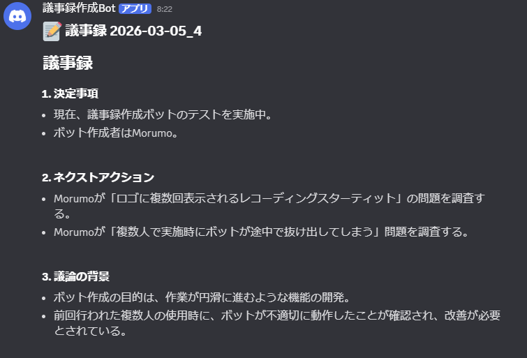

# DiscordMinutesBot

Discordのボイスチャンネルに参加し、ユーザーごとの音声を自動録音するBotです。全員が退出すると録音を保存し、オプションでWhisper APIによる文字起こしとChatGPTによる議事録生成を行います。



## 機能

- `/join` コマンドで録音開始、`/leave` コマンドで手動退出
- ユーザーごとに個別のWAVファイルとして保存（48kHz / stereo）
- 全員退出時に自動で切断・保存
- OpenAI Whisper APIによる文字起こし（オプション）
- GPT-4oによる議事録自動生成・Discordチャンネルへの投稿（オプション）

## セットアップ

### 必要要件

- Node.js v18以上
- Discord Botトークン
- OpenAI APIキー（文字起こし・要約を使う場合）

### インストール

```bash
npm install
```

### 環境変数

`.env` ファイルをプロジェクトルートに作成してください。

```env
DISCORD_TOKEN=your_discord_bot_token
CLIENT_ID=your_bot_client_id
GUILD_ID=your_guild_id
OPENAI_API_KEY=your_openai_api_key             # 省略可：文字起こし・要約用
MINUTES_CHANNEL_ID=text_channel_id             # 省略可：議事録投稿先（未設定時は/join実行チャンネル）
```

### スラッシュコマンドの登録

```bash
npm run deploy-commands
```

### 起動

`run_bot.bat` をダブルクリックしてください。

## 使い方

1. `/join` — Botが実行者のいるVCに参加し録音開始（チャンネル指定も可）
2. `/leave` — Botを手動でVCから退出させ、議事録を作成
3. VC内の全員が退出した場合も自動で録音停止・保存
4. `OPENAI_API_KEY` 設定時は文字起こし・議事録が自動生成される

## 録音ファイル

`recordings/` 以下に日付ごとのフォルダで保存されます。

```
recordings/
  2026-02-28/
    ユーザー名/
      recording.wav
    transcript.txt
    議事録_2026-02-28.md
```

## 技術スタック

- [discord.js](https://discord.js.org/) v14
- [@discordjs/voice](https://github.com/discordjs/voice)
- [prism-media](https://github.com/amishshah/prism-media) — Opus→PCMデコード
- [OpenAI API](https://platform.openai.com/) — Whisper / GPT-4o
