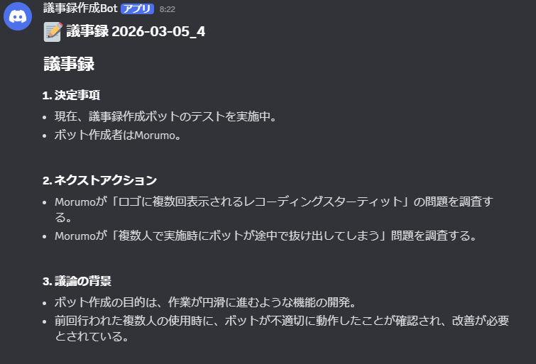

# DiscordMinutesBot

Discordのボイスチャンネルに参加し、ユーザーごとの音声を自動録音するBotです。全員が退出すると録音を保存し、オプションでWhisper APIによる文字起こしと、Claude CLIによるタイムスタンプ形式の議事録生成を行います。



## 機能

- `/join` コマンドで録音開始、`/leave` コマンドで手動退出
- ユーザーごとに音声を分離して録音し、タイムスタンプで時系列にミックスした単一WAVファイルとして保存（48kHz / stereo）
- 全員退出時に自動で切断・保存
- OpenAI Whisper APIによる**話者名・タイムスタンプ付き**文字起こし（オプション）
- Claude CLI（`claude -p`）による**タイムスタンプ／セクション形式**の議事録自動生成・Discordチャンネルへの投稿（オプション）

## セットアップ

### 必要要件

- Node.js v18以上
- Discord Botトークン
- OpenAI APIキー（文字起こしを使う場合）
- [Claude Code CLI](https://claude.com/claude-code)（議事録の要約生成に使用。`claude` コマンドがPATHにあること）

### インストール

```bash
npm install
```

### 環境変数

`.env` ファイルをプロジェクトルートに作成してください。

```env
DISCORD_TOKEN=your_discord_bot_token
CLIENT_ID=your_bot_client_id
GUILD_ID=your_guild_id
OPENAI_API_KEY=your_openai_api_key             # 省略可：文字起こし用
MINUTES_CHANNEL_ID=text_channel_id             # 省略可：議事録投稿先（未設定時は/join実行チャンネル）
```

> `OPENAI_API_KEY` が未設定の場合は録音のみ行い、文字起こし・議事録生成はスキップされます。

### スラッシュコマンドの登録

```bash
npm run deploy-commands
```

### 起動

`run_bot.bat` をダブルクリック、または以下を実行してください。

```bash
npm start
```

## 使い方

1. `/join` — Botが実行者のいるVCに参加し録音開始（チャンネル指定も可）
2. `/leave` — Botを手動でVCから退出させ、議事録を作成
3. VC内の全員が退出した場合も自動で録音停止・保存
4. `OPENAI_API_KEY` 設定時は文字起こし・議事録が自動生成され、Discordに投稿される

### 議事録のカスタマイズ

プロジェクトルートに `config.md` を作成すると、議事録生成時のプロンプトに追加方針として反映されます。未作成の場合はデフォルトの方針で生成されます。

## 議事録の形式

文字起こしは「`[MM:SS] 話者名: 発言`」形式で各ユーザーの音声を個別にWhisperへ送り、時系列に統合します。議事録は話題の切れ目でセクションに分割され、各セクションは次の構成になります。

```markdown
## [MM:SS] セクション見出し
**要約:** このセクションの内容を2〜3文で要約。

- 話者名: 発言内容
- 話者名: 発言内容
```

## 録音ファイル

`recordings/` 以下に日付ごとのフォルダで保存されます。同日に複数セッションがある場合は連番（`_2`, `_3`, ...）が付きます。

```
recordings/
  2026-02-28/
    recording.wav          # 全ユーザーをミックスした録音（48kHz stereo）
    transcript.txt         # 話者名・タイムスタンプ付き文字起こし（OPENAI_API_KEY設定時）
    議事録_2026-02-28.md    # Claude CLIによる議事録（OPENAI_API_KEY設定時）
  2026-02-28_2/
    recording.wav
    ...
```

## 既存録音からの議事録生成（スタンドアロン）

`generate-minutes.js` は、既に保存済みの `recording.wav` から文字起こし・議事録を再生成するスクリプトです（ミックス音声からの生成のため話者分離なし、要約は GPT-4o を使用）。

```bash
node generate-minutes.js recordings/2026-03-14
```

## 技術スタック

- [discord.js](https://discord.js.org/) v14
- [@discordjs/voice](https://github.com/discordjs/voice)
- [prism-media](https://github.com/amishshah/prism-media) — Opus→PCMデコード
- [OpenAI API](https://platform.openai.com/) — Whisper（文字起こし）
- [Claude Code CLI](https://claude.com/claude-code) — 議事録の要約生成（`generate-minutes.js` のみ GPT-4o）
